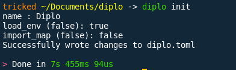
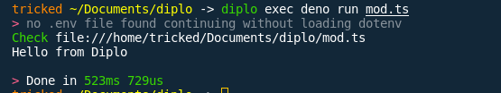

<h1 align="center">
   
  
   
  Diplo
   
</h1>

<h4 align="center">A fast dependency manager and script runner for <a href="https://deno.land/" target="_blank">Deno</a>.</h4>

---

    <a href="https://diplo.ascella.wtf/docs/getting-started/installing/">Installing</a> •
    <a href="https://diplo.ascella.wtf/docs/getting-started/quick-start/">Usage</a> •
    <a href="https://diplo.ascella.wtf/docs/getting-started/features/">Features</a> 

## Key Features

- Script running
  - Diplo has simple and easy to use script running capabilities
- Dependency management
  - Diplo manages dependencies by defining them in the diplo.toml file
- Dependency updating diplo can update all your dependencies using `diplo update`
- import maps Diplo creates import maps from your dependencies

## Screenshots

| name                               | screenshot                      |
| ---------------------------------- | ------------------------------- |
| Diplo running with watch option on |  |
| Diplo running without watch option |        |
| Updating modules                   |           |
| Adding modules                     |              |
| Init                               |             |
| Exec                               |             |

## Donating

`89prBkdG58KU15jv5LTbP3MgdJ2ikrcyu1vmdTKTGEVdhKRvbxgRN671jfFn3Uivk4Er1JXsc1xFZFbmFCGzVZNLPQeEwZc`

`0xc31a1A5dCd1a4704e81fB7c9C3fa858b9A00C7fb`

`qz9gyruyyvtwcmevtcnyru8gudenqjqeug096e459m`

## License

Apache-2

---
