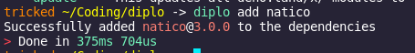
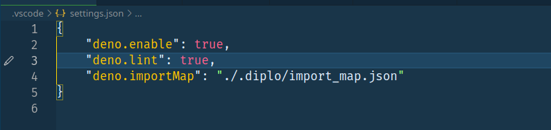
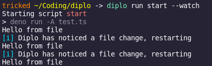
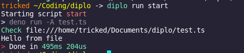
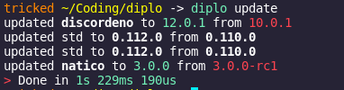

<p align="center" width="200" height="400">
	<br>
    
	<br>
</p>
 
<!-- # Diplo omit in toc -->

[](https://github.com/tricked-dev/diplo/issues)[](https://github.com/Tricked-dev/diplo/blob/main/LICENSE)[](https://crates.io/crates/diplo/)[](https://github.com/Tricked-dev/diplo/releases/tag/v0.3.1)[](https://discord.gg/mY8zTARu4g)

### Diplo is a script runner and dependency manager made in rust mainly for [Deno](https://deno.land/).

##### Documentation [Tricked.pro/diplo](https://tricked.pro/diplo)

- [Installing](#installing) - [windows installer](#windows-installer)
- [Features](#features)
  - [File watching](#file-watching)
  - [Easy dependencies](#easy-dependencies)
  - [Script running](#script-running)
  - [Dependencies](#dependencies)
    - [Updating Dependencies](#updating-dependencies)
  - [Dotenv Support](#dotenv-support)
  - [Example Config](#example-config)

# Installing

You can download diplo from the [releases tab](https://github.com/Tricked-dev/diplo/releases) or install it using `cargo install diplo` ( Recommended way since it adds diplo to the path )

### Windows

Theres a .msi installer for diplo in the windows.zip that you can use to install diplo make sure to select the add to path option  
Theres also a .exe which you can use instead but this requires you to add it to your path manually

### Linux

Theres a .deb file in the linux.tar.gz which you can use to install diplo on debian  
Theres also a PKGBUILD for archlinux users  
Theres also a binary in the linux.tar.gz which you can move into your bin folder

### Mac

Theres a binary which you can move to your bin folder

After that you can run `diplo init` for a interactive setup.  
or use `diplo init -y` for a one command setup

# Features

## File watching

Diplo can replace [Denon](https://github.com/denosaurs/denon) in terms of restarting on file change.  
To restart a script on save you just have to append `--watch` to `diplo run <script>`

```sh
$ diplo run <script> --watch
```

## Easy dependencies

Adding a new dependency is as simple as running `diplo add natico` or whatever else you need

Multiple dependencies at once are supported

```
$ diplo add natico
info: Successfully added natico@3.0.0-rc.1 to the dependencies
```

adding std modules

```
$ diplo add -s fs
info: Successfully added https://deno.land/std@0.110.0/fs/mod.ts to the dependencies
```



## Script running

You can easily create scripts like you do with npm and yarn

if you want to run the script just do `diplo run start` to run the start script.

```json
{
	"scripts": {
		"start": "deno run -A mod.ts",
		"node": "node index.js"
	}
}
```

#### Toml <!-- omit in toc -->

```toml
[scripts]
start = "deno run -A mod.ts"
node = "node index.js"
```

## Dependencies

Diplo will automatically create a deps.ts file in the .diplo folder if you have dependencies specified in the diplo.json file

```json
{
	"dependencies": {
		"natico": "https://deno.land/x/natico/mod.ts",
		"server": "https://deno.land/std@0.110.0/http/server.ts"
	}
}
```

#### Toml <!-- omit in toc -->

```toml
[dependencies]
natico= "https://deno.land/x/natico/mod.ts"
server= "https://deno.land/std@0.110.0/http/server.ts"
```

### Updating Dependencies

updating dependencies is a as simple as running `diplo update` note this will only update `deno.land/x/` packages

```
$ diplo update
info: updated discordeno to 12.0.1 from 11.0.1
info: updated harmony to v2.2.0 from v1.2.0
info: updated std to 0.110.0 from 0.10.0
info: updating done!
```

### Import Map Support <!-- omit in toc -->

> Typescript users will have to add this to the vscode settings.json (.vscode/settings.json)
> 

```ts
import * as server from 'server';
```

- note Diplo will automatically append `--import-map="./.diplo/import_map.json` after `deno run`.

```json
{
	"import_map": true
}
```

#### Toml <!-- omit in toc -->

```toml
import_map=true
```

## Dotenv Support

Diplo can automatically add environment variables using the rust dotenv module instead of the deno based one

```json
{
	"load_env": true
}
```

#### Toml <!-- omit in toc -->

```toml
load_env=true
```

## Example Config

This is a example of a json config file located at diplo.json.  
You can also use a toml config file named diplo.toml

```json
{
	"scripts": {
		"test": "deno run -A mod.ts",
		"build": "deno bundle a.ts"
	},
	"import_map": false,
	"load_env": true,
	"dependencies": {
		"natico": "https://deno.land/x/natico/mod.ts"
	},
	"watcher": {
		"directory": ".",
		"clear": true
	}
}
```

## Screenshots

### Diplo running with watch option on



### Diplo running without watch option



### Updating modules



### Adding modules


## Donating <!-- omit in toc -->

You can support the project by donating to my xmr address `89prBkdG58KU15jv5LTbP3MgdJ2ikrcyu1vmdTKTGEVdhKRvbxgRN671jfFn3Uivk4Er1JXsc1xFZFbmFCGzVZNLPQeEwZc`

## License <!-- omit in toc -->

This project is licensed under the terms of the [Apache License 2.0](./LICENSE)
